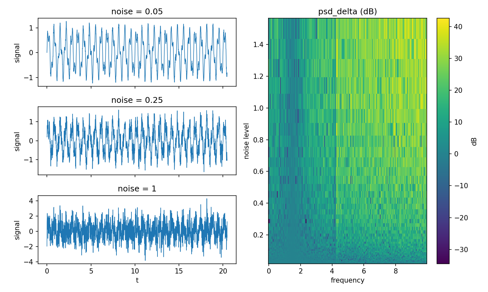
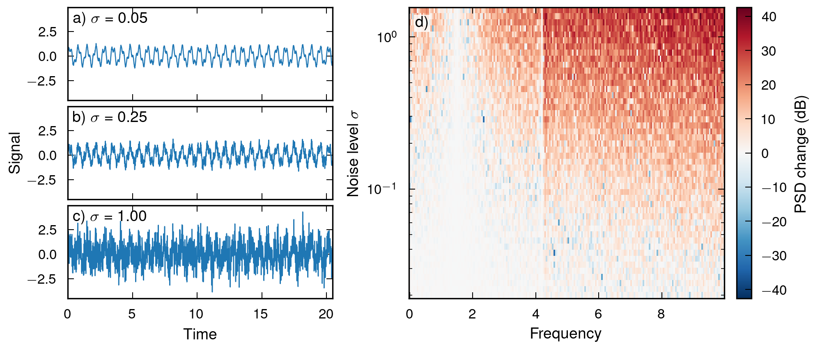

# figure-polish: the same request, with and without the skill

One loosely written figure request, given to two independent Sonnet agents on the same data.
The first was told to write the plotting code the way it normally would.
The second was told to invoke the `figure-polish` skill and follow it, including its rule that nothing is reported as finished before the rendered image has been looked at.

`make_data.py` writes `data.npz`: one periodic signal sampled at three noise levels (sigma 0.05, 0.25, 1.00), and the change in power spectral density, in dB, caused by noise, over 48 noise levels.
The three traces differ only in noise amplitude, and the PSD change is signed.

## Without the skill

```
make a figure, 2 columns, left column is a 3x1 stack of the signal time series
at the 3 noise levels, right column is one big heatmap of psd_delta vs
frequency and noise level, data is in data.npz
```

Produced by [`plot_plain.py`](plot_plain.py):



Each row autoscales to its own y range, ±1.2, ±1.6 and ±4.
The top two rows therefore look about equally noisy, when the noise in the second is five times the first.
The one thing the figure exists to show, how the signal degrades with noise, is the one thing this hides.

Around it: a title on every row repeating the noise level, the y label written out three times, three sets of x tick labels for one shared time axis, a sequential colormap on a signed quantity so zero change sits at no particular colour, a fat colorbar, and 15 by 8 inches of canvas, which shrinks every font once the figure is scaled into a column.

## With the skill

```
[figure-polish skill loaded]

make a figure, 2 columns, left column is a 3x1 stack of the signal time series
at the 3 noise levels, right column is one big heatmap of psd_delta vs
frequency and noise level, data is in data.npz
```

Produced by [`plot_polished.py`](plot_polished.py):



One y range across the three rows, so sigma = 0.05 reads as a clean oscillation and sigma = 1.00 as noise with a signal in it.
One shared time axis with tick labels on the bottom row only, one y label for the column, and the noise level folded into the panel letter instead of a title.
Axis labels are capitalised.
The PSD change gets a diverging colormap on a scale symmetric about zero, so the sign is readable and white means no change, and the noise axis is logarithmic because the levels are spaced that way.
6.6 inches wide, the double-column width, at 300 dpi, with the panels placed by hand through `fig.add_axes` so the colorbar does not pull the columns out of alignment, and the heatmap height matched to the full stack.

The scripts differ in shape too: every margin, gap and colorbar width in `plot_polished.py` is a named parameter at the top, which is what makes a round of render-and-look cheap.

One correction the verification rule caught: an earlier draft cropped the frequency axis to 8, on the assumption that only the two signal peaks mattered.
Checking the data showed the largest changes sit between 8 and 10, so the crop came out.

## Reproduce

```
python3 make_data.py
MPLBACKEND=Agg python3 plot_plain.py
MPLBACKEND=Agg python3 plot_polished.py
```

